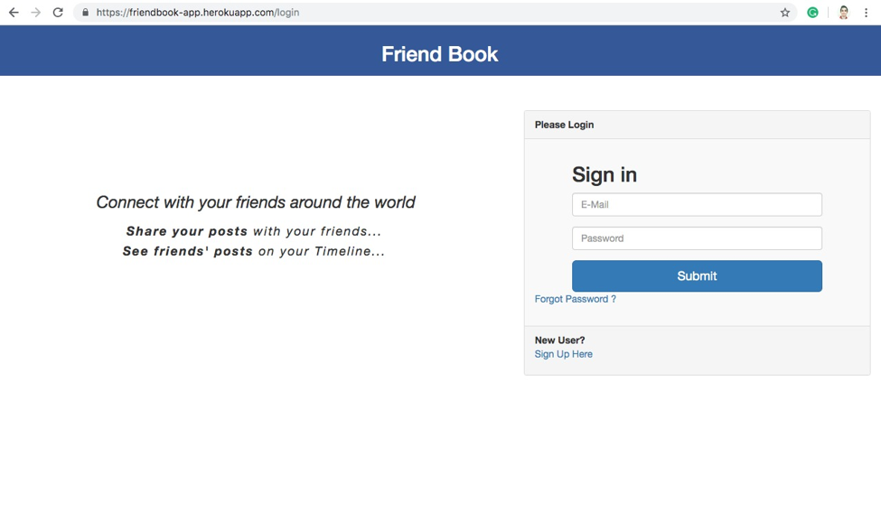
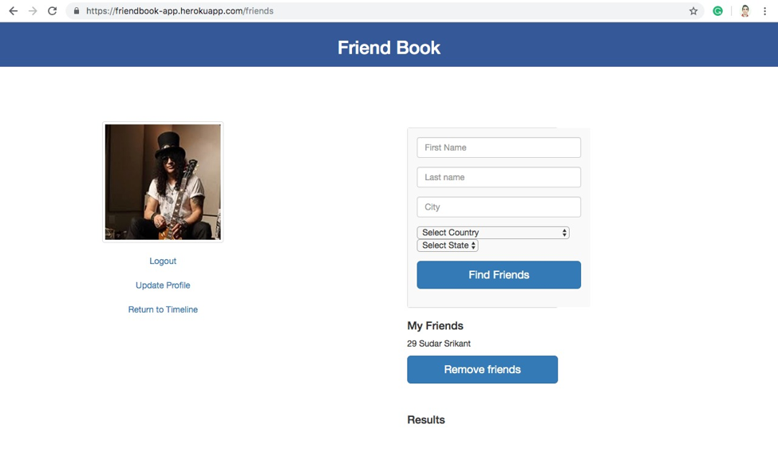
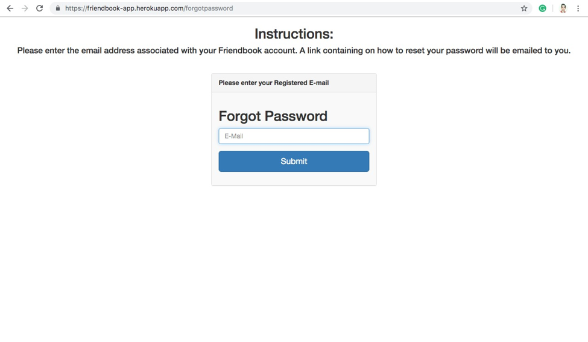

# FriendBook

Your journey to networking starts here!

Friendbook is a Java springboot application that mimics a raw Facebook type social media application. On Friendbook, you can create a profile, add friends and even chat with them! This project was developed to showcase the application of various software development practices from development to integration. The project has been set up in way such that it is auto deployed on the Heroku cloud and built using Jenkins.

## Prerequisites

A computer with a 4GB RAM with modern browser support such as Google Chrome, Mozilla Firefox, etc.

## Installation steps

On localhost:
* Download the code from the master branch
* Run mvn clean install to clean build the project.
* Run the application as a Springboot application.
* Begin by typing in the following URL in your browser: http://localhost:8085/login

## Deployment

The application has been deployed on the heroku cloud from the master branch of the Github project with the follwoing URL: https://friendbook-app.herokuapp.com/login

## Application screenshots

Landing page:

Friends page:

Forgot password page:

## Authors

* **Suman Singh**
* **Sudarshan Suresh**
* **Yash Desai**

